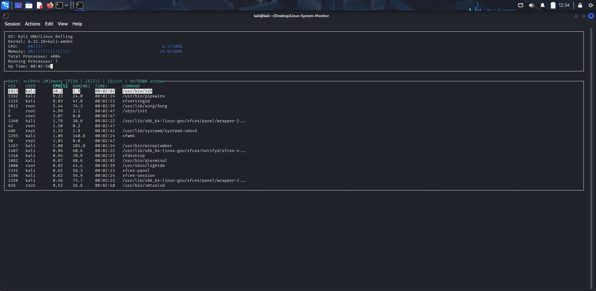
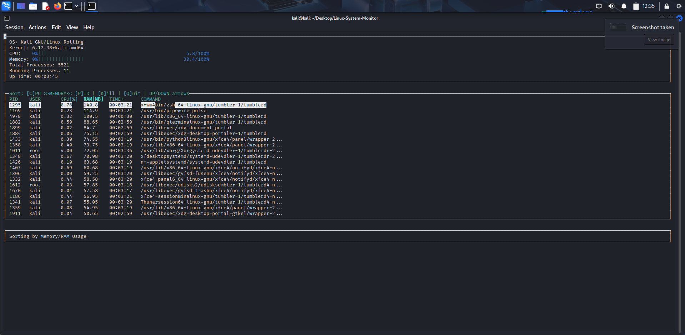
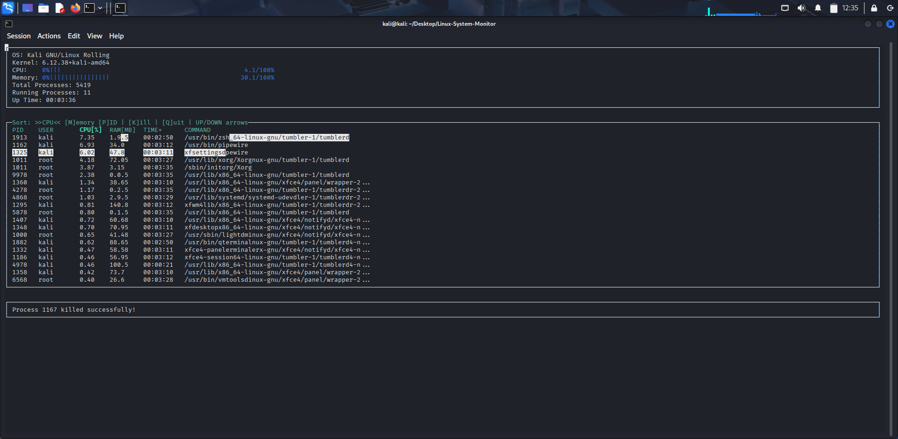
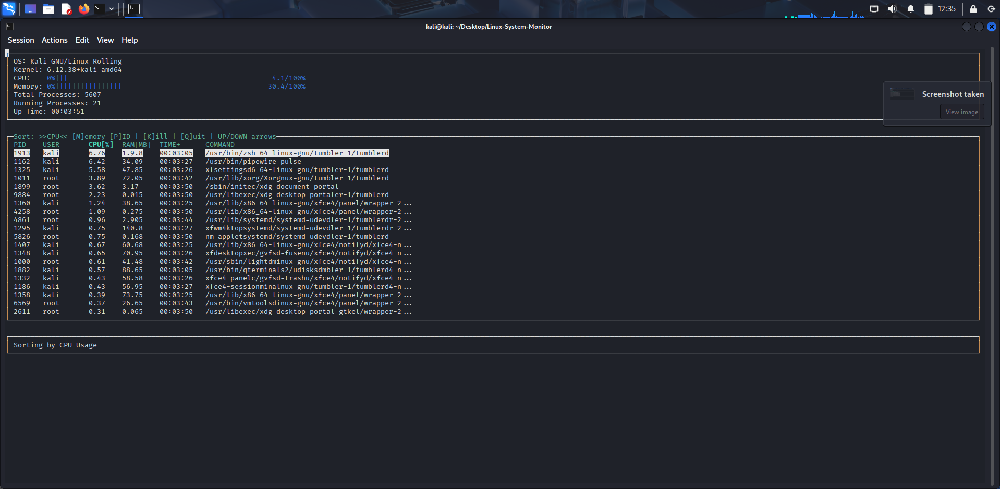

# Linux Monitor Tool









## Objective
Create a system monitor tool in C++ that displays real-time information about system processes, memory usage, and CPU load — similar to the `top` command.

## Day-wise Tasks
- **Day 1:** Design UI layout and gather system data using system calls.  
- **Day 2:** Display process list with CPU and memory usage.  
- **Day 3:** Implement process sorting by CPU and memory usage.  
- **Day 4:** Add functionality to kill processes.  
- **Day 5:** Implement real-time update feature to refresh data every few seconds.

## Features (Suggested)
- Process list with PID, user, CPU%, MEM%, command.  
- Sort by CPU, memory or PID.  
- Refresh interval (configurable).  
- Kill a process by PID (with confirmation).  
- Summary section showing total CPU usage, memory usage, and number of running processes.  
- Optionally a minimal ncurses-based TUI for terminal UI.

## Prerequisites
- Linux development environment.
- `g++` (supporting C++11/C++14).  
- `make` (optional).  
- (Optional) `libncurses` / `ncurses-dev` for a text UI:
  ```bash
  sudo apt-get install libncurses5-dev libncursesw5-dev
  ```

## Build & Run (example)
Below are two simple approaches: a basic single-file compile and a Makefile approach.

### Single-file (example)
If your main file is `main.cpp`:
```bash
g++ -std=c++14 -O2 -o linux_monitor main.cpp
./linux_monitor
```

### Using a Makefile
Create a `Makefile` and run:
```bash
make
./linux_monitor
```

## Implementation Tips
- Read process information from `/proc` (e.g., `/proc/[pid]/stat`, `/proc/[pid]/status`) to extract CPU and memory stats.  
- Use `/proc/meminfo` for system memory totals and `/proc/stat` for overall CPU times (to compute CPU usage percentage).  
- To compute per-process CPU%, sample process CPU time and system CPU time at two intervals and calculate the delta.  
- For sorting, collect process structures then `std::sort` with custom comparator.  
- Use `kill(pid, SIGTERM)` (or `SIGKILL`) to terminate processes — ensure you handle permissions and prompt the user before killing.  
- For real-time refresh, use a timer loop (e.g., `std::this_thread::sleep_for`) and redraw the UI each cycle. Consider double-buffering in ncurses to reduce flicker.


